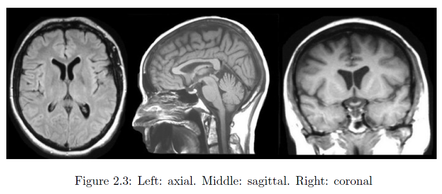
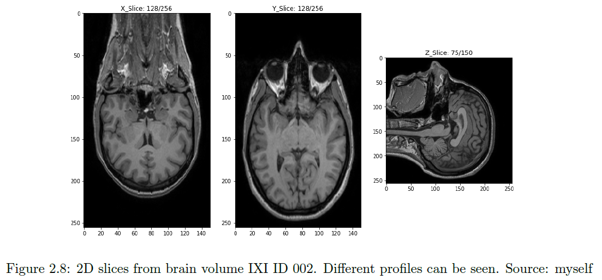
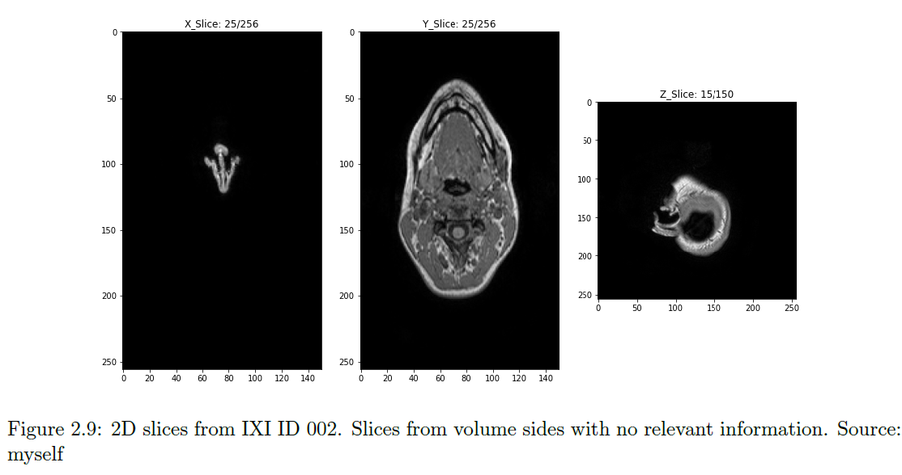
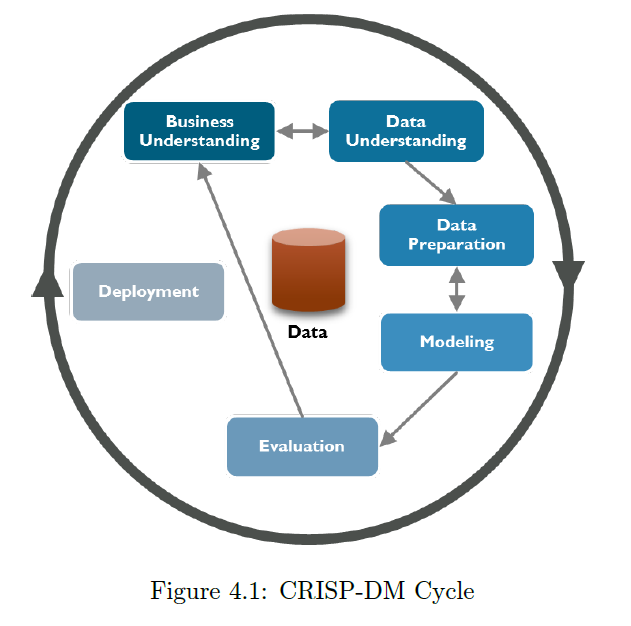
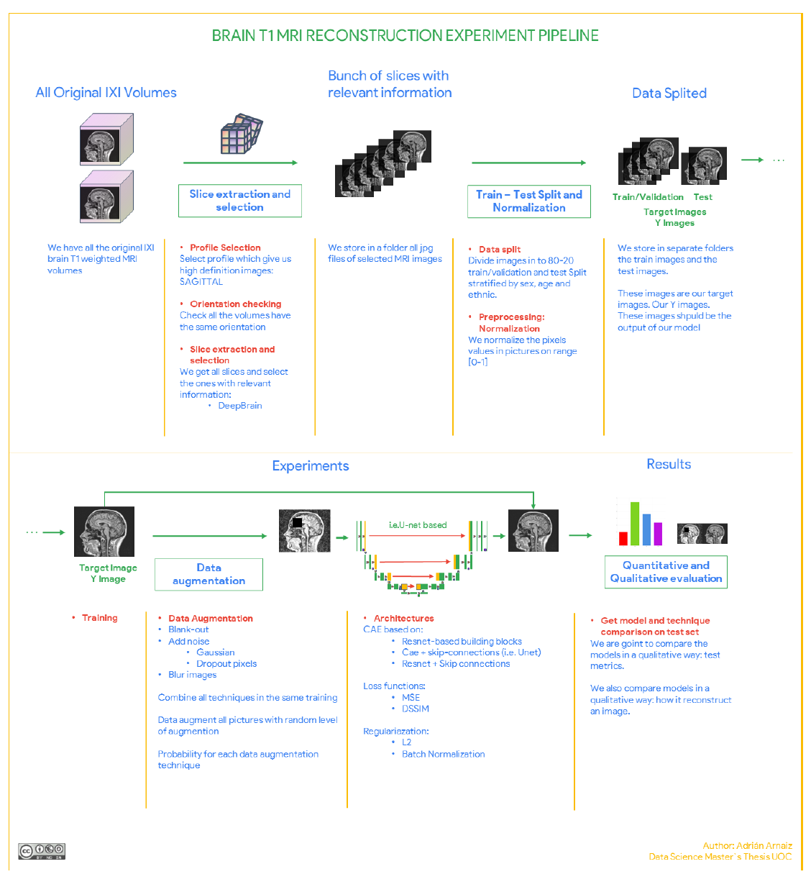

# Deep Convolutional Autoencoders for reconstructing magnetic resonance images of the healthy brain

---
[source: Deep Convolutional Autoencoders for reconstructing magnetic resonance images of the healthy brain](http://hdl.handle.net/10609/127059)

## Overview

The programming environment setup is shown in [Setup.ipynb](Setup.ipynb).

Purpose: **Learn MRI representation for reconstruction**.

Image reconstruction which is a mainly sub-problem of image enhancement, could help to achieve better results in:

- Data acquisition
  - Reconstruct the image from less data collected: faster scanning process
- Disease detection and segmentation
  - Unsupervised Anomaly Detection
  - Tumor segmentation (BraTS)
- Data Augmentation
  - Construction of pathology-free image from abnormal and viceversa
  - Artifical MRI gGeneration
- Image Enhancement
  - Reconstruction of cropped parts
  - Reconstruction without noise and artifacts
  - Definition enhancement: from low resolution to high resolution.

## Related Works

* [FastMRI](https://fastmri.org/) aims to improve MRI acquisition, with techniques based on collecting fewer data and using reconstruction techniques with DL to improve image quality and acquisition speed.
* [BRaTS](https://paperswithcode.com/task/brain-tumor-segmentation): This competition is compound by an MRI dataset from T1, T1c, T2 and FLAIR MRI and the goal is make the segmentation of the distinct parts of the tumor.

### Volumes or Slices
* Brain MR images are stored in volumes, it means that it used a 3D volumes represeenting somebody's head.
  * It is more complicated get good results in 3D than in 2D.
* When working in 2D we have to consider another decisions:
  1. what profile of the volume should we use: axial (from above the head), sagittal (from the side of the face, profile), and coronal (from behind the head).
  
  2. what 2D slice from the volume has relevant information. Some of the slices are slices of the extremes of the volume and it didn't represent relevant information about the brain structure.

### Summary

The related work use skip connections architectures: ResNet-based and CAE + Skip-Connection-based (U-Net-based and more).

Loss function: Most of studies use pixel-wise _MSE_, which implicit improves the evaluation of metrics *PSNR* and *SSIM*. *KL divergence* is added to loss function when VAE is used or *cross-entropy* and *cross-covariance* when semi-supervised autoencoder is used.

We are going to work with 2D slices of 3D brain MRI volumes. We can get many 2D images from one brain volume. In the preprocessing step, we firstly must choose what brain MRI view we are going to work with.

In order to get images with relevant information, we have recompiled some main methods in the state of art: get fixed number of slices from all volumes, get the middle slice from the volume or develop ourselves a computer vision tool to evaluate the thickness.

**Brain MRI preprocessing** differs depending on the objective. Some of the studies use the images of the dataset directly as the _target output_ of the network. Other works *enhance the image quality and contrast* before sending it like target output. *Downsampling* the input images could be also useful to reduce the number of parameters of the network. The resolution of the input image should be balanced between usability and trainability. We can *normalize the intensity* of pixels. Normalization of the inputs helps the training of the network due to several reasons. *Affine transformation* like translation or rotation could be applied. We can realize *data augmentation* in real-time by adding Gaussian noise, or cropping some parts.

## Scope

We will build an autoencoder for reconstructing T1-weighted brain MRI. It will learn how to encode the underlying structure healthy brains in a lower-dimension space, and reconstruct the MRI from this space. Image quality will be improved reducing noise and artifiacts and also could be used for lesion inpainting.

## Methodology

The methodology that best suits the project is the CRoss-Industry Standard Process for Data Mining (CRISP-DM) in a framework used for creating and deploying machine learning solutions. It has a iterative cycle, in which data, data preparation, modeling and evaluation are improved with the previous iteration feedback.

* Data Understanding: we should research the data sources as IXI, data quality and we should explore the data and its characteristics.
* Data Preparation: Data should be cleaned, filtered, selected and integrated if necessary. We could carry out tasks like preprocessing T1 weighted brain MRI or realize data augmentation.
* Modeling: Specify the model to use and the architecture, parameters. It can be an iterative process.
* Evaluation: We must evaluate models properly to get meaning ful conclusions.

## Project Development

### Pipeline and overview

1. We explore all the original NIFTI volumes. We select the best profile of the volumes to get the 2D images, we check the orientation of the slices and we extract the 2D images with relevant information.
2. We split the MRI volumes into 2 separated sets: train/validation and test. It is going to be a stratified splitting by age, sex, and ethnicity. We also check for duplicates and more information about the volumes such as relevant slices of each volume.
3. We define different architectures and a custom data loader in order to carry out these experiments with data augmentation in an optimized way. We run experiments with different architectures, with an without data augmentation, with and without L2 regularization and also using MSE and DSSIM loss functions.
4. We get the test metrics, we compare them all, and we also compare the models in a qualitative way.

### Dataset

#### Exploration and Preprocessing

We are going to work with [IXI brain T1-weighted MRI dataset](https://brain-development.org/ixi-dataset/). This public dataset composed by MRI images in NIFTI format. An initial exploration of the characteristics of this dataset could be seen in [MRI-nibabel.ipynb](MRI-nibabel.ipynb) and also some ddeper ones are discovered while profile selection, orientation checking, selection of relevant slices and data splitting.